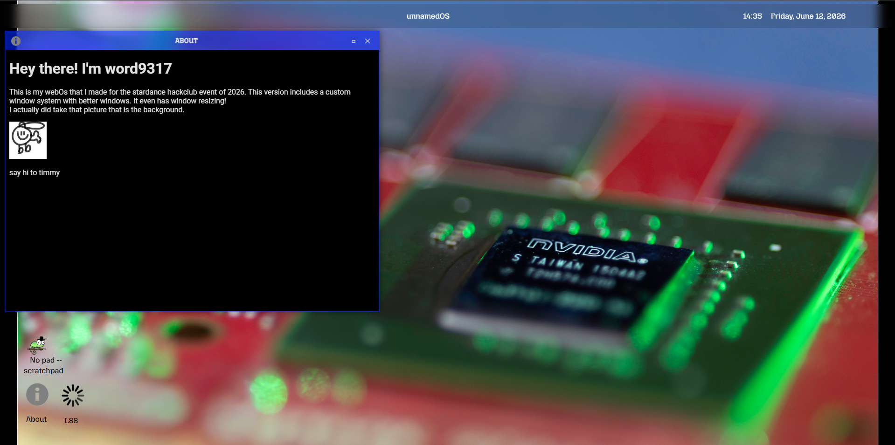

# This is my attempt at the Stardance Hackclub WebOS
## It has:
 - A boot animation
 - About window that launches automatically
 - No pad --(notepad, has persistent text saving, so even if you close and reopen the site, your notes are still there)
 - Loading Screen Simulator - Just in case you get bored(source code in this repo)

 ## Notice
 This project uses two scripts from other projects that I made before stardance